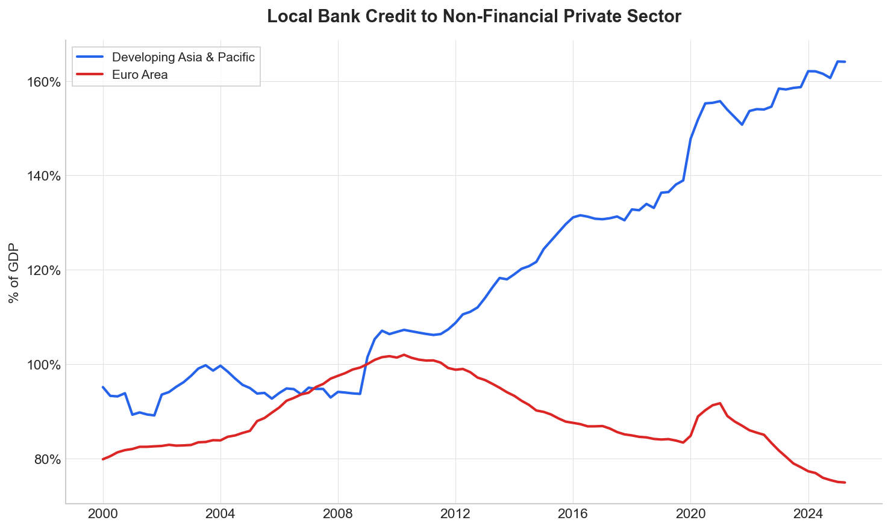
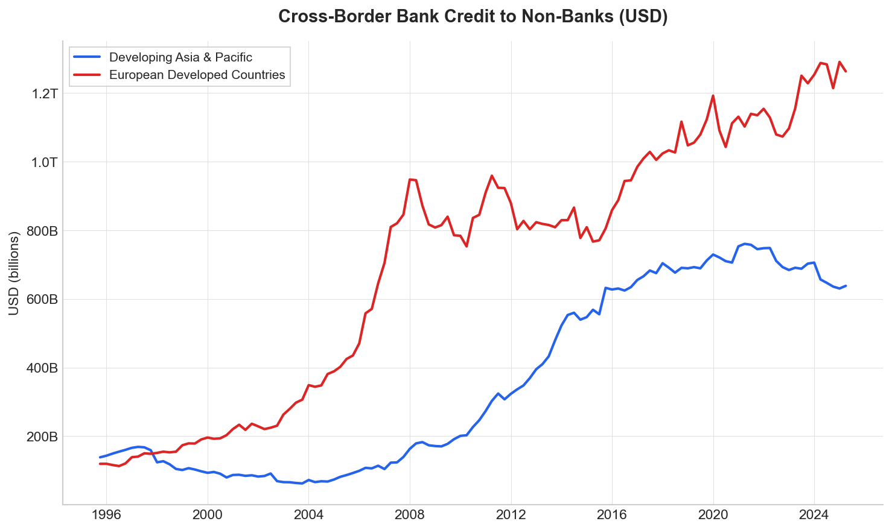

# getBISy

<p align="center">
  
  
</p>


A Python package for programmatically fetching and working with Bank for International Settlements (BIS) datasets.

The package currently allows access to the following sets of international financial statistics via the BIS data portal.

- Central Bank policy rates
- Bilateral exchange rates
- Locational banking statistics
- International debt securities
- Global liquidity
- Debt securities
- OTC derivatives
- Exchange-Traded derivatives

All major parameters are declared in custom enums to ensure type safety.

## Installation

```bash
pip install getBISy
```
## Usage

The below covers gathering and plotting two datasets gathered from the BIS Data Portal using this package: locational banking statistics (LBS) and Global Liquidity Indicators (GLI)

### Locational Banking Statistics

Import the relevant data functions and enums:

```python
# Test LBS

import getBISy.data as data
import getBISy.enums as enums

# Developing Asia and Pacific, Non-banks, Cross-border Credit, USD
s1 = data.get_locational_banking_data('Q',
                                        enums.LbsMeasure.Stocks,
                                        enums.Position.Claims,
                                        enums.Instrument.LoansAndDeposits,
                                        'USD',
                                        enums.CurrencyType.All,
                                        '5J',
                                        enums.Institution.All,
                                        '5A',
                                        enums.Sector.NonBanks,
                                        enums.Region.DevelopingAsiaAndPacific,
                                        enums.PositionType.CrossBorder)

s1['Description'] = 'Developing Asia and Pacific, Non-banks, Cross-border Credit, USD'

# European Developed Countries, Non-banks, Cross-border Credit, USD
s2 = data.get_locational_banking_data('Q',
                                        enums.LbsMeasure.Stocks,
                                        enums.Position.Claims,
                                        enums.Instrument.LoansAndDeposits,
                                        'USD',
                                        enums.CurrencyType.All,
                                        '5J',
                                        enums.Institution.All,
                                        '5A',
                                        enums.Sector.NonBanks,
                                        enums.Region.EuropeanDevelopedCountries,
                                        enums.PositionType.CrossBorder)
```


### Global Liquidity Indicators

As in the LBS example above, import the relevant functions and enums:

```python 

import getBISy.data as data
import getBISy.enums as enums

s1 = data.get_global_liquidity_data(freq='Q',
                               currency='TO1',
                               borrowing_country=enums.Region.DevelopingAsiaAndPacific,
                               borrowing_sector=enums.Sector.NonFinancialPrivateSector,
                               lending_sector=enums.Sector.Banks,
                               position_type= enums.PositionType.Local,
                               instrument_type=enums.Instrument.Credit,
                               unit_of_measure=enums.UnitOfMeasure.PercentageOfGDP
                               )

s2 = data.get_global_liquidity_data(freq='Q',
                               currency='TO1',
                               borrowing_country=enums.Region.EuroArea,
                               borrowing_sector=enums.Sector.NonFinancialPrivateSector,
                               lending_sector=enums.Sector.Banks,
                               position_type= enums.PositionType.Local,
                               instrument_type=enums.Instrument.Credit,
                               unit_of_measure=enums.UnitOfMeasure.PercentageOfGDP
                               )

```

Given the below plot in the context of the above, we infer that local bank credit to non-financial private sector in Developing Asia is replacing cross-border credit. 

## Project Structure
```
getBISy/
├── src/
│   ├── __init__.py
│   ├── data.py         # Main data-fetching functions
│   ├── enums.py        # Enum definitions for all API parameters
│   └── fetcher.py      # Fetcher classes for making API requests
├── requirements.txt
```
