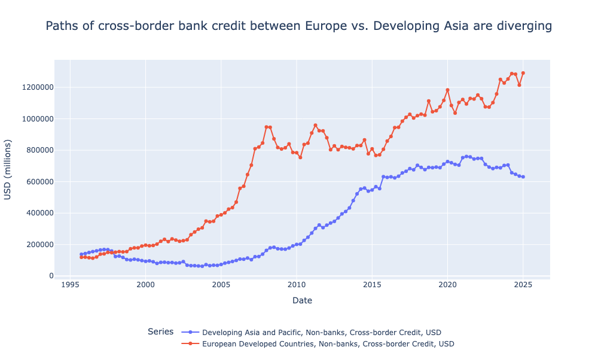

# getBISy



A Python package for programmatically fetching and working with Bank for International Settlements (BIS) datasets.

The package currently allows access to the following sets of international financial statistics via the BIS data portal.

- Central Bank policy rates
- Bilateral exchange rates
- Locational banking statistics
- International debt securities 
- Global liquidity data

All major parameters are declared in custom enums to ensure error-resistant paramaterisation.

## Installation

Clone the repository and install dependencies:

```bash
pip install -r requirements.txt
```

## Usage

Import the data functions and enums you need:

```python
from src.data import get_policy_rate_data, get_exchange_rate_data, get_locational_banking_data
from src.enums import LbsMeasure, Position, Instrument, CurrencyType, Institution, Sector, Region, PositionType

# Example: Fetch policy rate data
rates = get_policy_rate_data('US', 'M')

# Example: Fetch exchange rate data
fx = get_exchange_rate_data('USD')

# Example: Fetch locational banking data
lbs = get_locational_banking_data(measure=LbsMeasure.Stocks, position=Position.Claims)
```

## Project Structure
```
getBISy/
├── src/
│   ├── __init__.py
│   ├── data.py         # Main data-fetching functions
│   ├── enums.py        # Enum definitions for all API parameters
│   └── fetcher.py      # Fetcher classes for making API requests
├── requirements.txt
```
